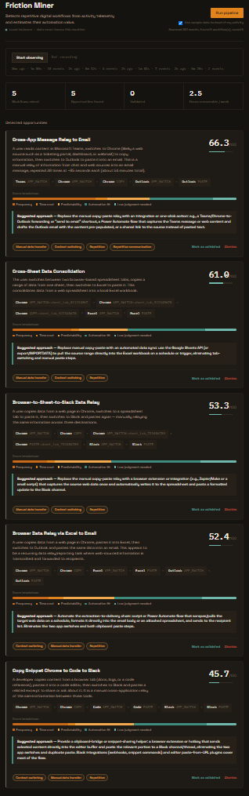

# Friction Miner

An AI-assisted system that observes digital work patterns, mines recurring cross-application workflows from raw activity telemetry, and estimates their automation value — without asking the user to describe their own workflows.

**Core hypothesis:** can a system reliably discover valuable automation opportunities from lightweight activity telemetry alone, using deterministic pattern detection as the foundation and an LLM only for semantic interpretation on top of it?

---

## What it does

Observe → Understand → Detect Friction → Quantify → Recommend → Validate

1. **Collects** low-level activity telemetry locally (active window, app switches, copy/paste, Google Sheets tab navigation) with an explicit Start/Stop control.
2. **Mines** repeated cross-application sequences deterministically — no LLM involved at this stage.
3. **Reconstructs** overlapping raw patterns into a small set of canonical workflows.
4. **Interprets** each workflow semantically with an LLM (naming, friction classification, automation suggestion) via structured tool-calling — validated against a fixed schema, never trusted as free text.
5. **Scores** the automation opportunity with a fully explainable, deterministic formula (frequency, time cost, predictability, automation fit, human judgment required).
6. **Presents** results in a local dashboard where the user validates (accept/reject) each finding — the system never assumes it's right.
7. **Exports** a starter [n8n](https://n8n.io) workflow skeleton for validated, high-automation-fit opportunities — a suggestion to configure, never an automatic deployment.

## Why this exists

Most "productivity AI" tools either require the user to manually describe their workflows, or silently score employee productivity. This project takes a different position: automation opportunities should be *discovered* from evidence, and the deterministic layer should do as much of the reasoning as possible before an LLM is involved at all — both for cost and for interpretability. It's also a personal exploration of the boundary between telemetry, workflow mining, LLM reasoning, deterministic scoring, and human-in-the-loop validation.

## Screenshot



---

## Architecture

Runs entirely on the user's own machine (local-first):

```
Windows Activity Collector  (subprocess, controlled from UI)
         |  APP_SWITCH / COPY / PASTE events, tagged with
         |  a session_id per Start/Stop observation cycle
         v
SQLite Event Store  (data/friction_miner.db)
         |
         v
Deterministic Sequence Miner  (sliding n-gram frequency)
         |
         v
Workflow Reconstructor  (collapses overlapping patterns,
         |                filters single-app noise)
         v
LLM Semantic Analyzer  (DeepSeek via tool-calling,
         |               Pydantic-validated output)
         v
Deterministic Opportunity Scorer  (explainable formula)
         |
         v
FastAPI backend  ------------->  Dashboard (HTML/CSS/JS)
         |                        localhost:5500
         +---> n8n workflow export (importable JSON, inactive)
```

The single user touchpoint is the browser dashboard. The dashboard starts and stops the collector, triggers pipeline runs, and lets the user validate findings — all through the FastAPI backend, which is a thin adapter with no business logic of its own.

## Tech stack

| Layer | Choice | Why |
|---|---|---|
| Language | Python 3.13 | |
| Event storage | SQLite | Local, zero-config, sufficient for a single-user prototype |
| Data validation | Pydantic v2 | Schema-enforced events, LLM output, and API contracts throughout |
| Telemetry | `pywin32`, `psutil`, `pynput`, `pywinauto` | Windows foreground window, process names, global keyboard hook, UI Automation for browser tab detection |
| Backend | FastAPI + Uvicorn | Thin HTTP adapter over the pipeline modules |
| LLM | DeepSeek (via an OpenAI-compatible gateway), tool-calling for structured output | Cost-effective, fast, sufficient for a labeling/classification task — a reasoning-heavy model was deliberately avoided (see below) |
| Frontend | Plain HTML/CSS/JS, no build step | No framework overhead for a single local dashboard page |
| Automation export | n8n workflow JSON | Recommends an automation approach without ever deploying anything |

## Getting started

Requires Python 3.13+ on Windows (the collector uses Windows-specific APIs) and an API key from an OpenAI-compatible LLM gateway.

```powershell
# 1. Clone and enter the project
git clone https://github.com/mjy976/friction_miner.git
cd friction_miner

# 2. Create and activate a virtual environment
python -m venv venv
.\venv\Scripts\Activate.ps1

# 3. Install dependencies
pip install -r requirements.txt

# 4. Configure your LLM gateway
copy .env.example .env
# then edit .env with your API key, base URL, and model name
```

Run the backend and frontend in two separate terminals:

```powershell
# Terminal 1 - backend (no --reload: it tracks a live collector subprocess in memory)
$env:PYTHONPATH = "src"
python -m uvicorn friction_miner.api.main:app --port 8000
```

```powershell
# Terminal 2 - frontend
cd frontend
python -m http.server 5500
```

Open `http://localhost:5500`. Click **Start observing**, work normally for a while, click **Stop observing**, then **Run pipeline**. If you don't have enough real activity data yet for a repeated pattern, tick "Use sample data instead" to see the full pipeline end-to-end on a synthetic dataset — five realistic role-based workflows (Business Analyst, Data Analyst, Call Center Specialist, Product Manager, Developer), generated by `run_persona_synthetic_demo.py`.

## Repository layout

```
src/friction_miner/
|-- events/         Event schema (Pydantic), versioned
|-- collector/      Windows telemetry collectors + browser tab detection
|-- storage/        SQLite event persistence
|-- synthetic/      Synthetic event generator for testing without real data
|-- mining/         Deterministic sequence pattern miner
|-- workflow/       Overlapping-pattern to canonical workflow reconstruction
|-- llm/            LLM client + structured semantic analysis
|-- scoring/        Deterministic, explainable opportunity scoring
|-- opportunities/  Persisted opportunity records + validation state
|-- sessions/       Observation session tracking (the "bank" of past runs)
|-- automation/     n8n workflow export
`-- api/            FastAPI backend (thin adapter, no business logic)
frontend/           Single-page dashboard (no build step)
run_*.py            Standalone scripts for testing each pipeline stage in isolation
```

## Privacy by design

This system observes activity on the user's own machine, so privacy constraints were treated as architectural requirements, not an afterthought:

- **Metadata over content, everywhere.** Copy/paste events record content *type* and *length* only — the actual clipboard content is never read into memory for storage. Window titles are metadata (what's open), not document contents.
- **Position-filtered UI Automation.** Detecting which Google Sheets worksheet tab is active requires reading the Chrome address bar via UI Automation — but the same accessibility tree also exposes individual spreadsheet cell content as "Edit" controls. The collector checks each control's on-screen position *before* reading any text, and only reads controls within the toolbar area (near the top of the window); nothing below that boundary is ever read, so cell content is structurally unreachable, not just filtered after the fact.
- **Local-first, always.** All telemetry and analysis stays in a local SQLite file. The only outbound call is the LLM interpretation step, and only the already-compressed, already-anonymized-of-content workflow shape is sent — never raw events.
- **Full user control.** Observation is explicitly started and stopped from the dashboard; nothing is collected passively in the background without the user's action.

## Notable engineering decisions

A few things that came up during development and shaped the final design:

- **Data source contamination.** Early on, synthetic test data and real collector data shared one database, and a demo script silently accumulated duplicate synthetic runs into it. Pattern mining then "found" a workflow at 40x the real frequency. Fixed by adding an `EventSource` field, separate database paths for synthetic vs. real data, and treating this as a first-class lesson: telemetry pipelines need provenance tracking from day one, not as an afterthought.
- **OS key-repeat vs. real key presses.** Holding Ctrl+V for a fraction of a second longer than expected fires multiple native key-repeat events, which without debouncing were logged as multiple paste events. Fixed by tracking which keys are currently held down and ignoring repeats until release.
- **Clipboard race condition.** Reading the clipboard immediately on a Ctrl+C keydown sometimes returned the *previous* clipboard content, because Windows' low-level keyboard hook fires before the source application finishes writing to the clipboard. Fixed by deferring the clipboard read via a short `threading.Timer`, off the hook's own thread (which must return quickly or Windows silently disables it).
- **A SQLite migration trap.** `ALTER TABLE ADD COLUMN` in SQLite always appends the new column physically at the end of the row, regardless of where it's declared in `CREATE TABLE`. Code that did `SELECT *` and unpacked columns positionally broke silently after the first schema migration. Fixed by always selecting columns by name, and by writing an idempotent `ensure_column()` helper so schema evolution never requires wiping accumulated data again.
- **A reasoning model's hidden token cost.** The LLM gateway's default model turned out to be a hybrid "thinking" model that spent tokens on an internal reasoning trace even for a simple structured-labeling task, with the output silently cut off under a small `max_tokens`. Explicitly disabling thinking mode (`extra_body={"thinking": {"type": "disabled"}}`) removed the overhead entirely for a task that never needed multi-step reasoning in the first place — a case for matching model capability to task complexity rather than defaulting to the most capable available model.
- **Deterministic opportunity IDs.** Opportunity records were originally keyed by a random UUID, so re-running the pipeline on the same discovered workflow created a duplicate record and silently reset any validation decision the user had already made. Switched to an ID derived from a hash of the workflow's step sequence, so re-running updates evidence and score in place while preserving the user's accept/reject decision.
- **Synthetic timing that silently flattened every opportunity score.** An early version of the multi-persona demo dataset used unrealistically short gaps (a few seconds) between steps in each simulated workflow. Since time spent per week is one of the largest weighted components of the opportunity score, every workflow ended up clustered in a narrow, unconvincingly low band regardless of how different the underlying workflows actually were. The scoring formula wasn't the problem — the synthetic data didn't reflect how long a step like "compile a report in Excel" actually takes a person. Fixed by rewriting each step's timing to reflect the real cognitive work involved, not a plausible-looking small number.
- **A birthday-paradox collision in synthetic scheduling.** Placing roughly 100 workflow occurrences fully independently and randomly across a ten-day window produced frequent near-collisions: two *unrelated* occurrences from different simulated roles would sometimes land within the pattern miner's 5-minute session gap, purely by chance. The miner then correctly stitched their adjacent steps into a single "pattern" that never actually happened as one workflow — a chimeric false positive, not a bug in the mining logic itself. Fixed by generating one shared, pre-spaced schedule up front that guarantees a minimum buffer between every occurrence (of any role, plus background noise) instead of relying on randomness to avoid collisions.

## Known limitations

- The collector and the analysis pipeline are currently started/stopped independently rather than fully unified end-to-end; the dashboard controls the collector, but a meaningful automation opportunity still requires enough *real* accumulated observation time (this is a data volume issue, not a pipeline bug — the system surfaces this honestly with a clear message rather than fabricating a result).
- Single-user, single active collector session at a time, tracked in the API process's memory — restarting the API process while the collector is running loses track of it (mitigated by running the API without `--reload` during real use).
- The n8n export only maps a small, verified set of applications (Excel, Teams, Google Sheets) to real n8n nodes; everything else becomes a labeled placeholder rather than a guessed node type that could import as broken.
- LLM interpretation is not perfectly deterministic — the same workflow can get slightly different wording or scores across runs. The opportunity score's largest components come from deterministic telemetry specifically to limit how much the final number depends on this variance.

## Roadmap

- Level 3 telemetry for Excel specifically (worksheet/cell-range interaction, not just window/tab switches)
- Automation experiment: measure discovery precision/false-positive rate against manual workflow review
- Package the collector as a background service with a tray icon instead of a terminal process

## License

This project is licensed under the MIT License -- see [LICENSE](LICENSE) for details.
